In this tutorial, we’ll be making a gem-collecting game. By the end of this tutorial, you should feel comfortable:

- Downloading Assets from the Asset Store
- Working with Colliders to detect when objects touch
- Making and using Prefabs to reduce needless copy-pasting

> [action]
>
Open Unity and create a new 3D project called GemHunter:
>
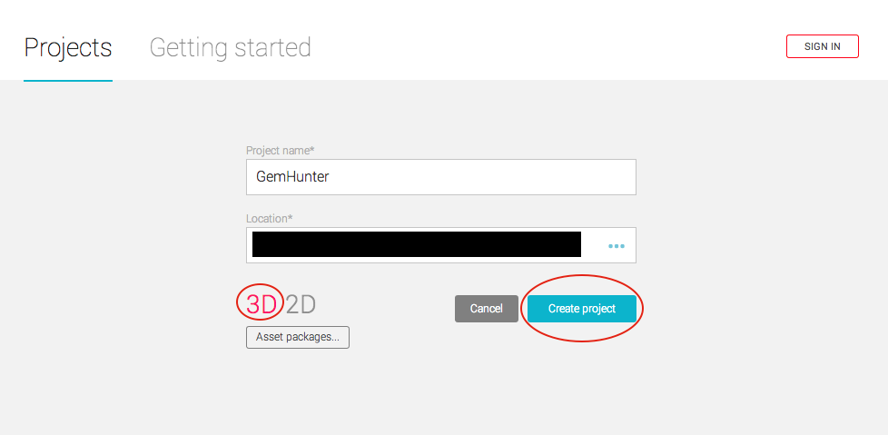

You should see a 3D world with a 3D rotation widget in the top-right corner of the Scene view, and a `Main Camera` and `Directional Light` in your Hierarchy panel.

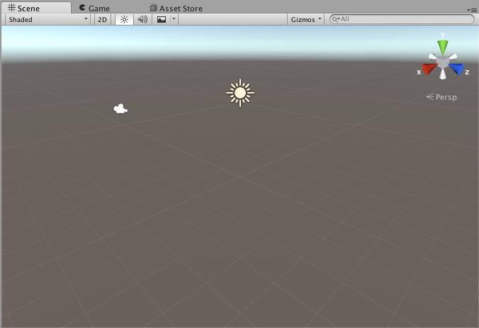

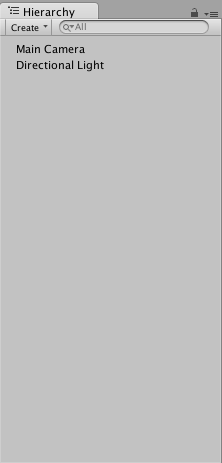

> [info]
>
If you do not see this, navigate from the top bar to `Edit->Project Settings->Editor` and make sure that the `Default Behavior Mode` is set to `3D` rather than `2D`.
>
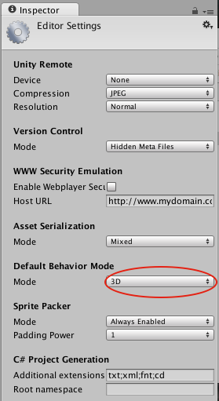
>
This tells Unity to apply certain default settings that make working in 3D easier than it would be otherwise. Because Unity is a 3D engine, even if you don’t select this option, you can still build a 3D game; you just need to be more cognizant about default settings.

Our game takes place in 2D, but we want to use 3D default settings so that we can get used to working with them.

> [action]
>
Save your current scene (`File->Save Scene As`) with the name "Play" and place it in a folder called `Scenes` in your Project Panel. If you had to change settings from 2D to 3D, before doing this, create a new scene (`File->New Scene`).

You can create a folder in the Project Panel by right-clicking and selecting `Create->Folder`. You can double-click to view the project’s contents.

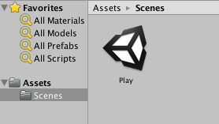

# Ready player one

We’re going to start by creating a Player.

> [action]
>
Create an Empty Game Object (`GameObject->Create Empty`) in the scene and call it `Player` (`right-click it in the Hierarchy Panel->Rename`).
>
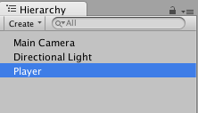

Unless you’ve moved around in the Scene view, Player should already be at `(0,0,0)`. You can confirm this by selecting Player and checking its Transform component’s properties in the Inspector. If they’re not `(0,0,0)`, set them to those values.

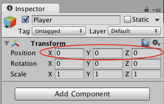

> [info]
>
Unless dragged into a position in the Scene, Unity creates new objects at the center of Scene view, which is why if you’ve changed where the Scene view is looking, the object may have spawned somewhere else.

Let's put a Cube on the player so we can see it!

> [action]
>
Right-click `Player` and select `3D Object->Cube` from the menu. A cube should appear in your Scene view, and you should see a Cube nested under your Player in the Hierarchy Panel.
>
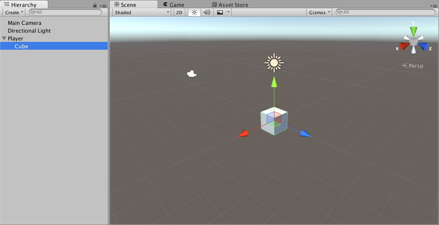

You can view how everything looks in-game through our camera and with lighting by either pressing the big "Play" arrow at the top or switching to the Scene View via the tab at the top.

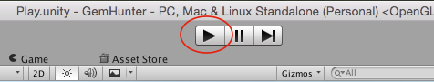

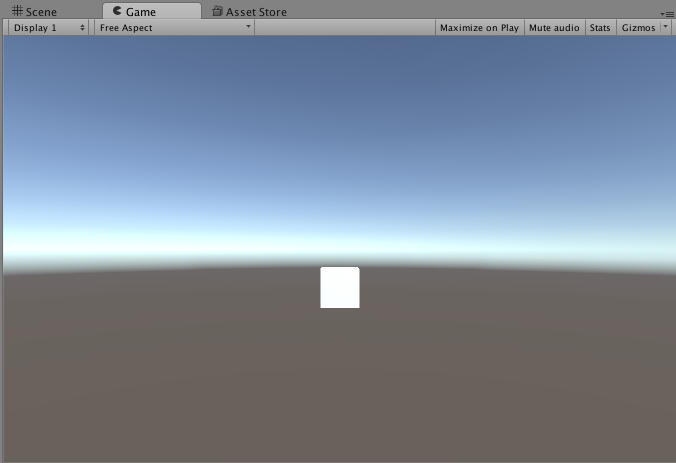

Stop the scene by pressing the Play arrow again.

# Are you my mother?

> [action]
>If you created a Cube instead by selecting `Game Object->3D Object->Cube` or clicked the back panel instead of the Player when you made a Cube, it won’t be nested under the Player. To fix this, drag it onto Player.
>
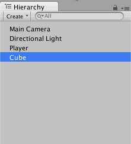
>
Select Cube and look in the Inspector.
>
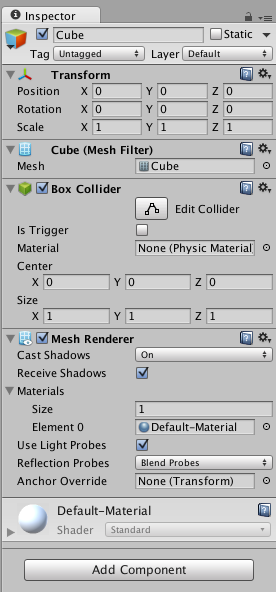

You’ll notice it has a _bunch_ more components than Player does!  It has a `Transform` component (just like Player), but it also has other options. These are things that make it a Cube (`Mesh Renderer` gives it color, `Mesh Filter` gives it shape, `Box Collider` makes it bump into/detect collisions).

We want this Cube to be purely cosmetic (for now!  Don’t worry!  It’ll be prettier than a Cube in the end!), and not to affect how objects collides, so we want to remove the `Box Collider`.

> [action]
>
Click the gear icon in the top right of the Cube’s `Box Collider` component and select `Remove Component`.
>
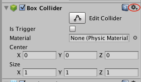
>
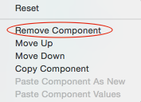

Now look at the Hierarchy Panel again.

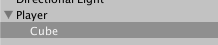

The way Cube is nested under Player in the Hierarchy Panel indicates that the Cube is the _child of Player_, and _Player is Cube’s parent_ -- in the graphics sense of the words "child" and "parent". If you’re used to Object-Oriented Programming, but not used to graphics, you might hate this, but "child" and "parent" in graphics mean something different... In graphics, a child moves, rotates, and scales based on how its parent is moved, rotated, and scaled. Another way to say this: the parents Transform modifies its child's Transform.

> [action]
>
Select `Player` and set its `Transform` `position` to `(0,0,1)`. You should see the Cube appear to move, but if you select the Cube itself, you’ll notice that Cube’s Transform component indicates that it’s still at `(0,0,0)`!
>
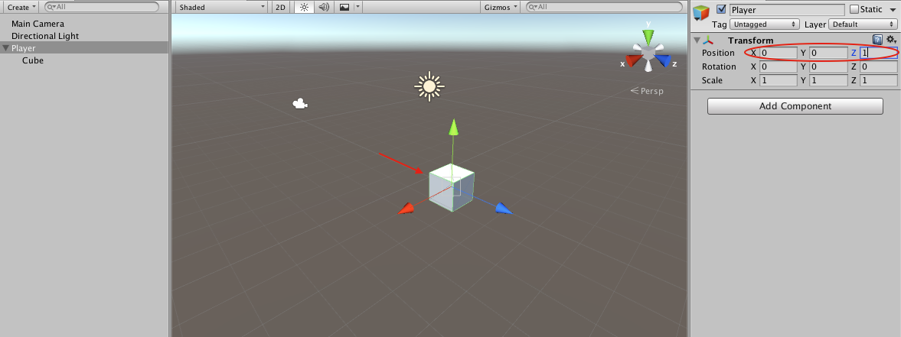
>
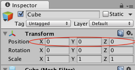

This is because the Transform gives you local (i.e. with-respect-to-the-object) information rather than global (i.e. with-respect-to-the-world) information. The Cube’s final position in world space is its parent’s position in world space **PLUS** its position in local space, so `(0,0,1) + (0,0,0) = (0,0,1)`, and the Cube APPEARS to be at `(0,0,1)`.

The other Transform properties act in a similar way (rotations add, and scales multiply).

> [action]
>
Move Player back to (0,0,0).
