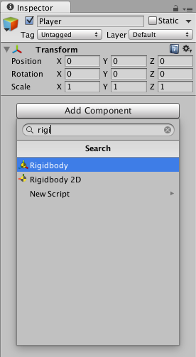
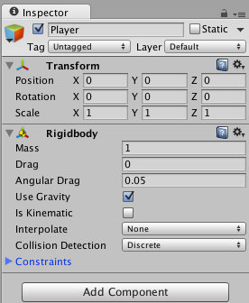
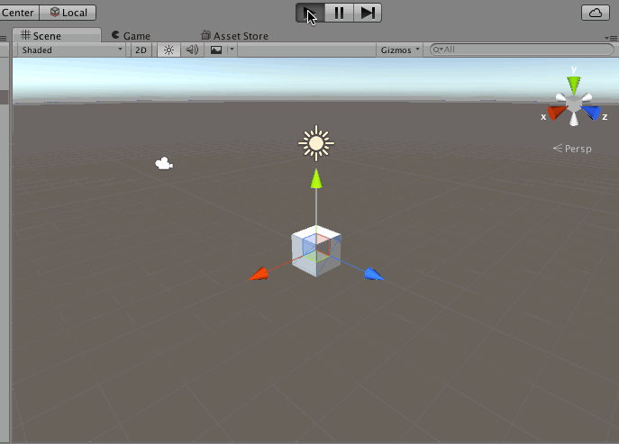
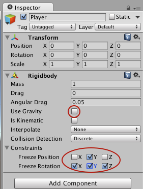
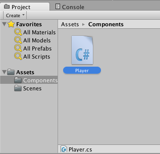
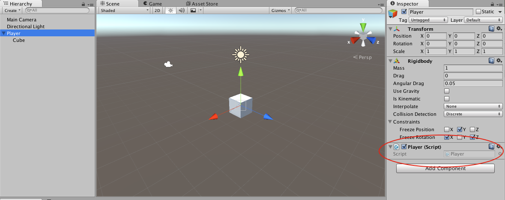
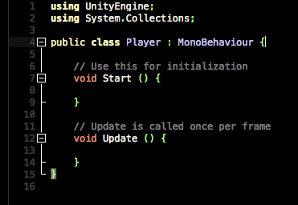
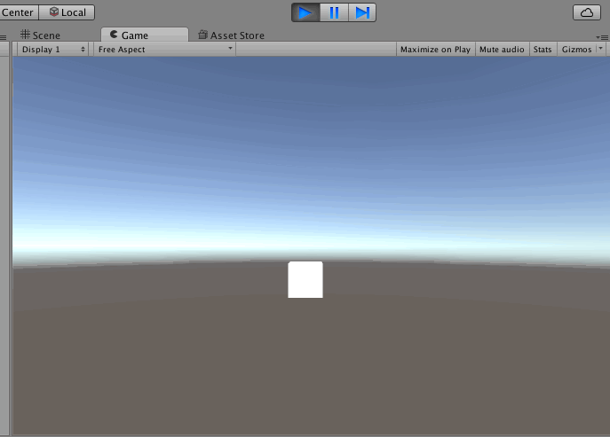
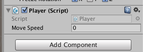
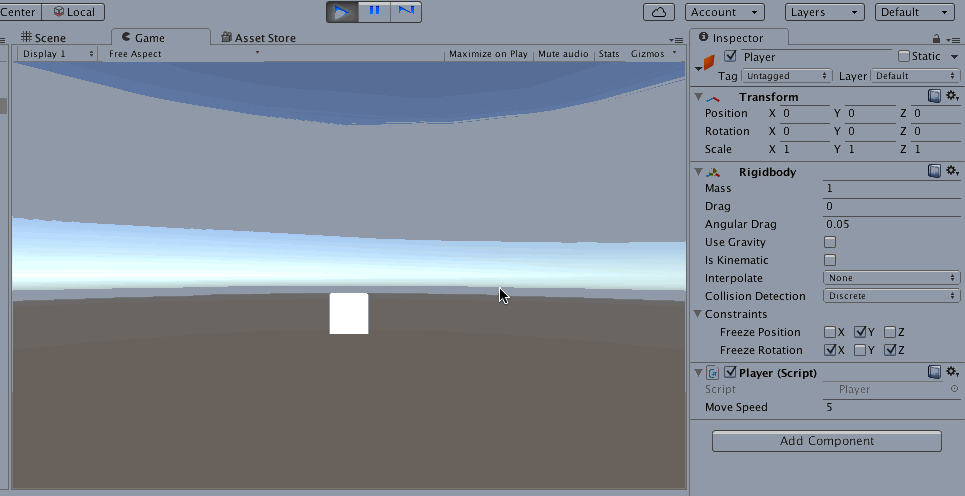

Now we’re going to make Player move around in our space.

> [action]
>Add a Rigidbody component to Player by selecting Player, clicking "Add Component," and finding the component named Rigidbody.



You should see the component added in the Inspector.



Rigidbody is a component you can add to objects to allow you to allow them to move using physics. Let’s check out what it did.

> [action]
>Run the scene, and you should see Player fall!



Stop the scene.

> [action]
>Uncheck the "Use Gravity" option, click the arrow to expand the Constraints section, and check the boxes to freeze rotation in x, y, and z; and to freeze position in y.



We’ve told this object not to have a gravity force applied to it, because our game is going to be top-down and doesn’t need to simulate gravity. We’ve also specified that the RigidBody shouldn’t allow the object to go up (in the y direction) or rotate about its x or z axes. If the idea of rotating around an axis is unfamiliar to you, think of an axis as a rod you can grab. Rotation about that axis means only in the direction you could twist your hand while still holding the rod.

You may have already noticed, but Unity’s coordinate system in 3D makes y point up, x point right, and z point forward. When possible, it's best to build your scene this scene to maintain this orientation to prevent confusion.

#Making the Player Move


We’re going to make our Player move with a script we’ll write together!

> [action]
>Create a new folder in the Project Panel named Components, create a new C# script inside it (right-click inside the Components folder, Create->C# Script), and name it "Player."

As is the default for scripts you create in Unity, this is a script is actually a component, that is a script that applies logic to an object, just like the RigidBody component.



> [action]
>Add the Player component to the object Player in your Hierarchy Panel by dragging it from the Project Panel, or using the Add Component button. You can confirm it was added by selecting Player in your Hierarchy Panel and looking in the Inspector.



> [action]
>Double-click the Player component in your Project Panel to open it in Visual Studio.

You should see that some code has already been generated for you!



As you can see, the Player component is really a class that inherits from MonoBehaviour. This gives it its component-like nature.

When an object is loaded in a Scene, all of its components get loaded as well, and their Start methods get called. As long as the object stays active in that scene, all of that object’s components will have their Update methods called each frame.

If you’re used to Object Oriented Programming, you may be starting to wonder, does this class represent my game object?  No, actually, it does not. A component is just something that a Game Object can HAVE to make it have different functionality. No single class DEFINES any Game Object, but you CAN reference the root object to which any component is applied, and we’ll show you how later in this tutorial.

We’re going to modify this component’s code to accept inputs and make the player move in the x and z directions accordingly.

> [action]
>Above the Start method, add the following line to define a public property:
>
```
private Rigidbody rb;
```
>
put the following code into the Start method:
>
```
rb = GetComponent<Rigidbody>();
```
>
and put the following code into the Update method:
>
```
float inputH = Input.GetAxis("Horizontal");
float inputV = Input.GetAxis("Vertical");
>
Vector3 direction = new Vector3(inputH,0,inputV);
>
rb.velocity = direction * 5;
```
>

Save the component!

> [action]
>Run the scene, and you should now be able to move the player around using the arrow keys. Afterwards, we’ll explain the code.



Cool. Stop the scene, and let’s look at that code.

The method Input.GetAxis uses values defined in Unity’s Input Manager to get a value between -1 and 1 for certain keys (by default, "Horizontal" gives +1 for the right arrow key and -1 for the left arrow key, and `Vertical` gives +1 for the up arrow key and -1 for the down arrow key), which we’ve put into a Vector of length 3 to represent which direction we want to move in x, y, and z.   

Remember: x is to the right, and z is forward, so we’ve mapped the left/right arrow inputs to x movement and up/down arrow inputs to z movement. Y is always 0, because we never want to move up or down.

We make our object actually move by setting the velocity of the Rigidbody, which we have stored as a private variable and set in our Start method by using the GetComponent method. The GetComponent method gets the first component of the specified type that’s attached to the object this component’s attached to. It’s actually a shortcut for saying "gameObject.GetComponent<Foo>()" where `gameObject` refers to the gameObject to which this component is attached.

You may be wondering about that mysterious 5 we used when we set the Player’s velocity. This is an arbitrary number we picked to represent the speed. Multiplying a vector by a scalar (regular number) gives a vector that’s that much longer. Since our inputs range from -5 to 5, this means our velocity will be between those values in either the x or z directions with a max of (5,0,5) and a min of (-5,0,-5).

But… that 5 is rather arbitrary. Wouldn’t it be great if that weren’t so hard-coded, so we could easily change it later?

> [action]
>Turn that 5 into a public member variable of type float named "moveSpeed".

<!-- -->

> [solution]
>
>We added the declaration above the Start method:
>
```
public float moveSpeed;
```
>
and replaced the 5 in the velocity setting line with that variable:
>
```
rb.velocity = direction * moveSpeed;
```

Save the component!

Now when you view the inspector, you should see a new field in your Player component!



> [action]
>Set the value of this new Move Speed field to 5, and Run the Scene.

Everything should be as it was before.

> [action]
>Now, with the scene still running, change the value of Move Speed to, say, 50. (After you click on the Inspector, you may need to click on the Game View to regain focus)



Pretty cool huh!  You can set this value in the Editor at any time to see how different values affect your game.

Once you stop playing, though, all values set this way will go back to what they were before, so be sure to write them down if you want to use them in your game!

Great. Stop the scene.
