We’re ready to set up our level.

First off, our camera view isn’t in the best spot for a top-down game, so let’s adjust that.

Select Main Camera.  This is the way players will see in our game!  Since you can have more than one camera in a scene, probably the most important feature of Main Camera is the tag MainCamera.  Unity looks for the object with this tag to use as the Camera to use to make a scene’s Game View.

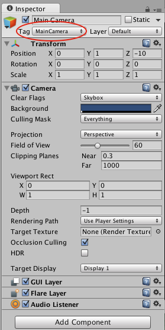

Set Main Camera’s position to (0,8,-8) and set its rotation to (45,0,0), so that it’s a little more interesting than straight downward.  As you were doing this, you may have noticed that the Scene View provides you with a handy preview of what the Camera sees in the bottom corner.  You can view through a Main Camera also by selecting the Game View at the top at any time.

Now for the level.

Create a new Plane (GameObject->3D Object->Plane) and position it at (0,0,0) if it isn’t already.

When you look through the camera, you may notice it’s a little difficult to make out the geometries you’ve got there.

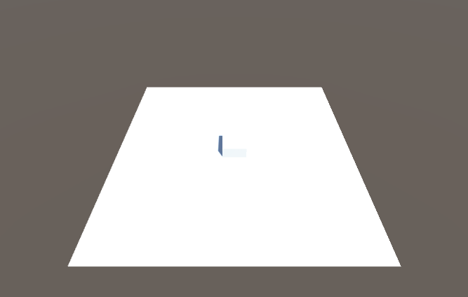

Set the Directional Light’s Light Type from Directional to Point and Bounce Intensity to 0.

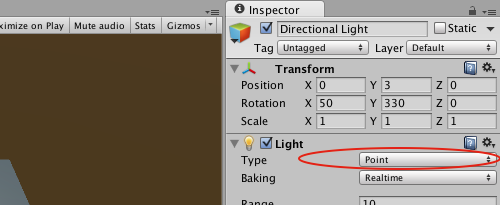

Much better.

Our plane at (0,0,0) is currently going through our Player, but rather than moving our Plane down, let’s move our Player’s child Cube up a bit.

Select the Player’s Cube and set its Transform to (0,0.5,0).

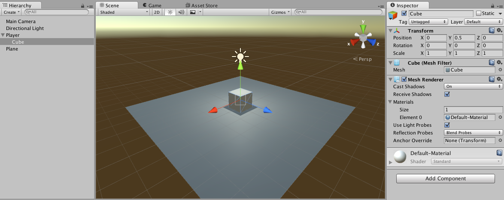

The reason we’ve moved our Cube up rather than our Plane down is because then y = 0 will be the ground, which is easier to remember than y = -0.5.

Add a Cube at position (5,0.5,0) and scale (1,1,10) to make a wall.

Now add 3 more such Cubes to make the remaining walls along the other edges of the Plane.  You may find it helpful to use the coordinate widget in the top right of the Scene View to make sure everything is aligned as you’d like it to be.  You can click a second time on the widget to switch between Perspective and Orthographic views.

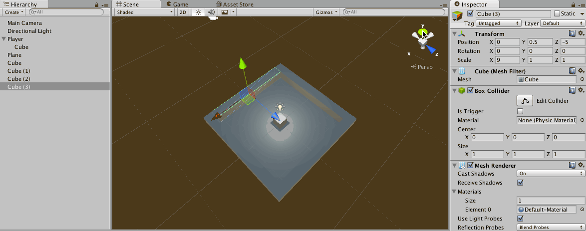

If you Play the game now, you’ll be able to move around in the space, but you’ll go through the walls.

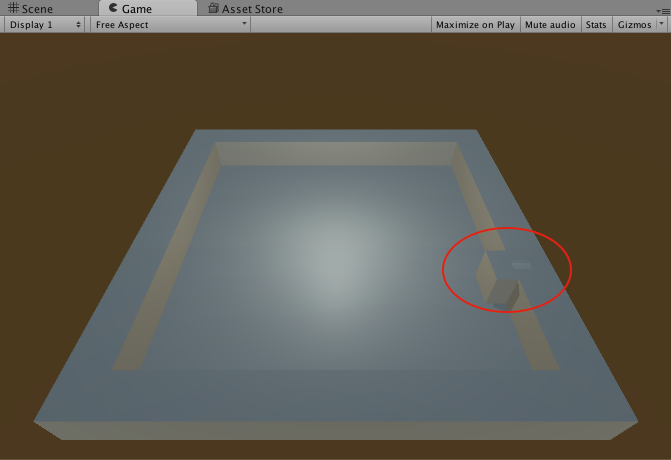

Add a Sphere Collider component to Player and set its center to (0,0.5,0).

Now you shouldn’t be able to go through the walls.  You’ll tumble a little, but we’ll fix that in a little bit.

The Cube has done us well so far, but now we want something that clearly faces a direction so we can make our Player face the direction of motion.

Open up the Asset Store window (Window->Asset Store) and search "Survival Shooter Essentials."

Hit "Enter" and click on Survival Shooter.

Click on Download to begin the download process.  You may need to create an account or sign in to the Asset Store.

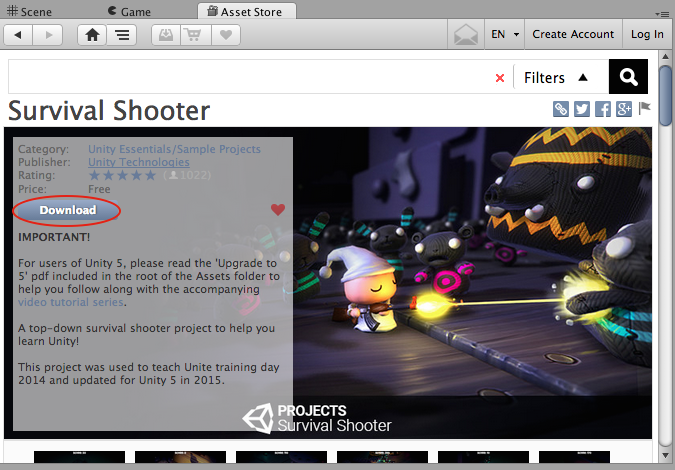

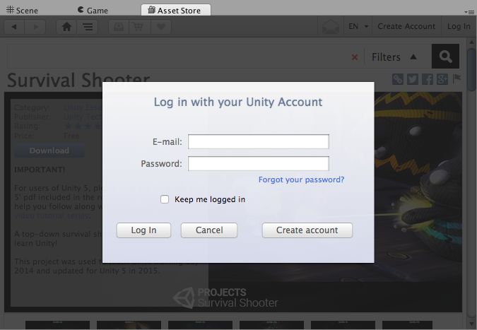

Read and accept the license agreement.

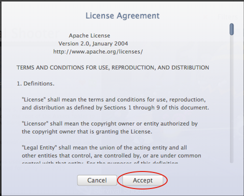

You may get a warning, since this project involves some Project Settings.  We don’t plan on importing them, but you’ll need to click "Import" to progress to the next step.

When you do, a window should appear listing all the bits and pieces that come with this package.  Check marks indicate items that will be imported when the "Import" button in the bottom right is clicked.

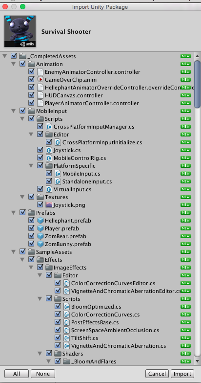

Go ahead and click "None" to uncheck everything, and then check the following:

* Materials/ZombearMaterial.mat

* Models/Characters/ZomBear.fbx

* Prefabs/ZomBear.prefab

* Textures/ZomBearDiffuse.png

* Textures/ZomBearEmission.png

* Textures/ZomBearNormal.png

Then click "Import."  When you do, new folders should appear in your Project Panel.

For better organization, create a new folder called Downloads and drag in the new folders that were created (Materials, Models, Prefabs, Textures).

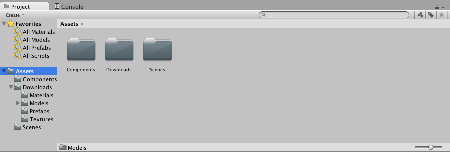

Now we’re going to replace our cosmetic Cube that’s a child of Player with a ZomBear.

Select the Scene tab to switch back to your Scene View from the Asset Store.

Select Player in the Hierarchy Panel.  In case you can’t see it in your Scene View, with Player selected, hover over the Scene View and press the "f" key.

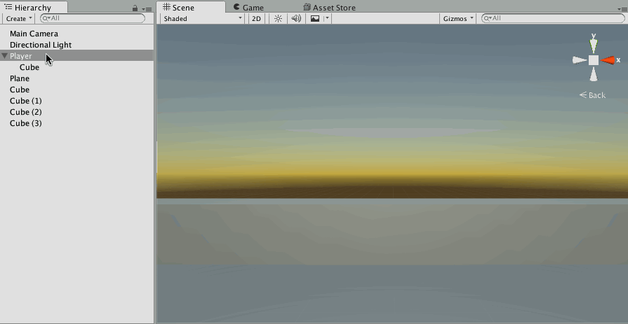

Now Drag a ZomBear Prefab from Downloads/Prefabs/ in your Project Panel onto Player in your Hierarchy.

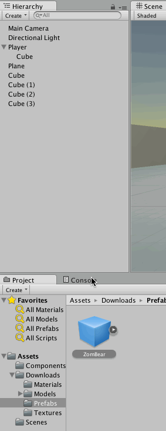

Delete the Cube from Player (right-click it and select "Delete"), and your Player should now just be visually represented with the ZomBear!

If you try to run the game though, you’ll notice a few issues.  First, the Player appears to glitch to the side on the first few frames.

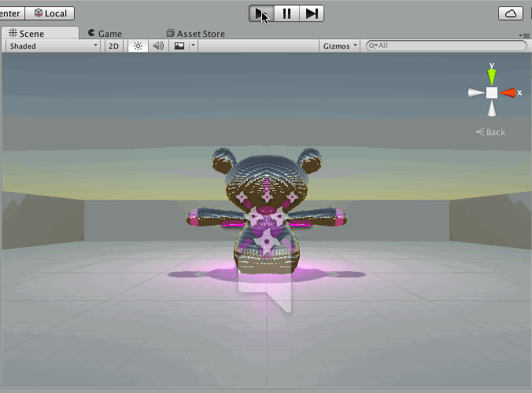

Second, if you select the Console Panel in the bottom, you’ll notice a few Warnings.

We’ll fix these issues by removing some components the ZomBear Prefab has that we simply don’t need.

These are occurring because we didn’t import the scripts that the ZomBear Prefab uses to make it act like a ZomBear, because we don’t want it to.  Even so, the Prefab imported with references to these nonexistent scripts, so we’ll want to remove them.

Select the ZomBear nested under Player and scroll through its components until you see a missing script.  Simply remove each of those components (there should be 3).

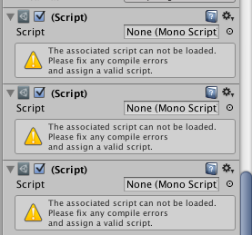

Additionally, remove the:

* Animator

* Rigidbody

* Capsule Collider

* Sphere Collider

* Nav Mesh Agent

* Audio Source

That’s… pretty much everything actually, so when you’re done, only the Transform should remain.

You may notice when you remove the Animator component that the ZomBear flips 90 degrees.  To fix this, set its rotation to (0,0,90).

Now when you run the Scene, you should get no Warnings in your Console, nor should the Player appear to glitch to the side.

By the way, in case you want to make the Console visible at all times, you can reposition it by clicking and dragging on the tab.

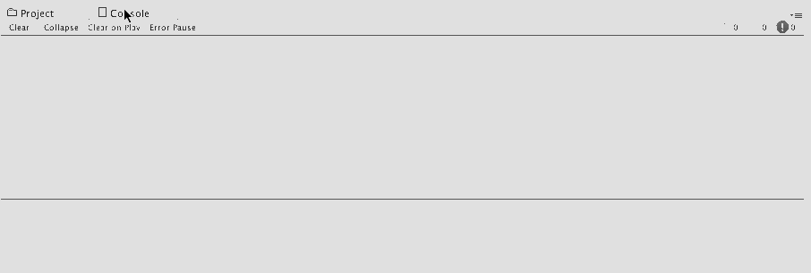

If you rearrange the panels in a way that you prefer, you can save that layout by selecting Layout->Save Layout in the top right-hand corner.

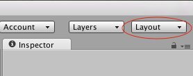

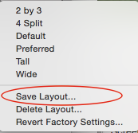

If you’ve saved a layout, you can use it at any time by selecting it from this menu.  This tutorial uses the Default layout, by the way.

We’re also going to clean up ZomBear a little bit.  Expand ZomBear, and you’ll notice it has some children of its own.

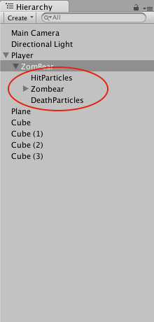

Zombear (not to be confused with ZomBear) has the mesh that makes the form and color of the model and has an object with a light nested to it.  HitParticles and DeathParticles are Particle Systems that rely on some things we haven’t imported.

Delete HitParticles and DeathParticles.

Great!  Not only is this model pretty, but it's also asymmetrical so we know which way its facing.
