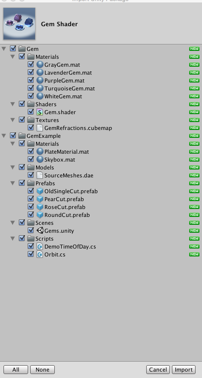
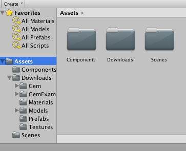
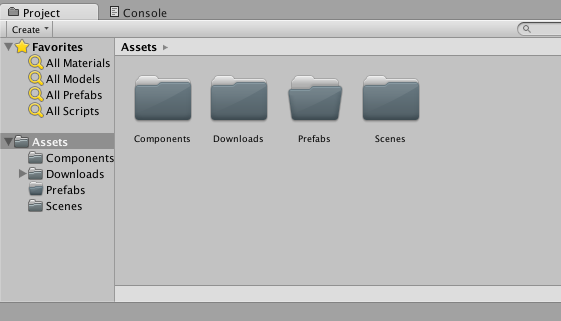
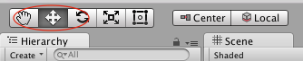

We want the Player to face the correct direction when it moves, so we’re going to set its Transform to always face the direction of movement (if its velocity is nonzero).

> [action]
>
Open up the Player component in Visual Studio and add the following lines to the end of the Update method:
>
```
if (rb.velocity.magnitude > 0) {
  transform.forward = direction;
}
```
>
And Freeze the Player’s `Rigidbody` component’s `y` rotation.
>

>
Run the Scene to check it out!
>


Why does our code make the Player face the right way, and why did we need to freeze y rotation?

Our code assign tells the Player’s Transform to point forward aligned to the direction of motion when the Player’s Rigidbody is moving. We check if the Rigidbody is moving by seeing if the velocity's magnitude is greater than zero. The magnitude will always be a non-negative number, and, unless the magnitude is zero, the velocity is nonzero in some direction.

We froze `y` rotation to prevent tumbling. This can happen due to forces applied on collisions with the walls. If we didn’t do this, the Rigidbody would calculate some rotational velocity and apply that to the Transform. Then we would appear to spin around while not moving in any direction.

# Gems on the Asset Store

Now that we set up our Player and Level, let’s add some collectables!

> [action]
>
Go back to the Asset Store tab and search "Gem Shader."  Select the _Gem Shader_ package and bring up the import window.
>

>

>
Uncheck the Scripts and Scenes folders, but leave everything else selected, and import.
>

>
When the import finishes, move Gem and GemExample into Downloads.
>


# Adding a gem

> [action]
>
Create an Empty Game Object at `(0,0,1)`, name it "Gem" and drag `Downloads/GemExample/Prefabs/OldSingleCut` onto it in the Hierarchy Panel.
>

>
That Gem is TINY! Not a problem. Select the child `OldSingleCut` and set its scale to `(25,25,25)`.
>


Note that we've scaled up the child, `OldSingleCut`. The parent keeps its scale of `(1,1,1)`. This will be convenient if we ever want to rescale the gem.

> [action]
>
Next, set `OldSingleCut`’s position to (0, 0.5, 0) and remove its `Rigidbody` component.
>


We’ve moved it up so that it isn’t clipping through the ground, and we’ve removed the Rigidbody because we don’t want it to have physics applied to it.

> [action]
>
Select `OldSingleCut`’s child object, `Mesh`, and remove its `Mesh Collider` component.
>

>
Now select `Gem`, give it a `Sphere Collider`, and check the `Is Trigger` box. `Is Trigger` is a setting that makes the Collider not actually push objects away when it touches them, but still able to detect when collisions begin, are still happening, and end. This means we should expect to be able to walk through our `Gem`.
>


# Collecting gems

We’re going to use this Trigger Collider and the Player’s Collider to detect collisions between Players and Gems.

> [action]
>
Create a new script in your `Components` folder, name it `Gem`, and drag it onto `Gem` in the Hierarchy Panel.
>

>

>
Open the Gem component in Visual Studio and add the following method to it:
>
```
void OnTriggerEnter(Collider col) {
  Debug.Log("Gem Hit!");
}
```
>
Run the Scene, and now, whenever you run through Gem, a log should appear in your Console.
>


The `OnTriggerEnter` method gets called on every component of a `Game Object` that has a `Collider` set as a `Trigger` (like the one on `Gem`), whenever that `Collider` detects a collision with a `Collider` (`Trigger` or not).

> [info]
>
There are also some similar methods: `OnTriggerStay`, `OnTriggerExit`, `OnCollisionEnter`, `OnCollisionStay`, `OnCollisionExit`. These each do what their names imply -- the Trigger methods only get called if the Collider that was hit is a Trigger, and Collision methods only get called if the Collider that was hit is *not* a Trigger.

When a Gem gets hit by a Player, and only when hit by a Player, we want that Gem to disappear. That means we should check to see if the object we hit was a Player. To do this, we can check to see if it has the Player component attached to it.

> [action]
>
Replace the code inside Gem’s OnTriggerEnter method with the following:
>
```
if (col.gameObject.GetComponent<Player>()) {
  Destroy(gameObject);
}
```
>
Save the component.

Now when you run into the Gem, it should get removed from the Scene!  You should see this both visually in the Game View and in the Hierarchy Panel.


To explain our code a little bit: `col.gameObject` refers to the `Game Object` that entered this `Collider`. We’re using the `GetComponent` method to find the `Player` component. In the case that we don’t find one, we’ll get `null`, which behaves similarly to `false` in a conditional.

In the case that the `Game Object` with we’ve collided has a `Player` component, we remove the `Game Object` that has this component (`Gem`) on it from the `Scene` using the `Destroy` method.

The variable `gameObject` of any component refers to the `Game Object` that has this component. Similarly, `transform` refers to the transform component of any `Game Object` that has this component.

> [info]
>
You *could* also find the transform by saying `gameObject.transform`. As you might guess, this leads to the ability to reference something ridiculous-but-totally-accurate, like `gameObject.transform.gameObject.transform.gameObject.transform.gameObject` etc etc…  While this is *technically* correct… just… don’t do it…  Like, really... why would you ever...?

# MOAR GEMS PLZ

We want more than 1 Gem in our level! If we copy-pasted this Gem we have right here and then wanted to make some changes, we’d have to make those changes to each copy, which would be non-ideal.

Unity has a solution: _Prefabs_.

A few of the folders we’ve encountered have been named "Prefab" so what does that mean?  A Prefab is like a blueprint for a Game Object, complete with all the children and components it has. The really cool thing, though, is that you can update Game Objects that were generated from a Prefab by updating the Prefab definition.

> [action]
>
Create a new folder in Assets called Prefabs
>

>
Drag `Gem` from the Hierarchy Panel into this folder in the Project Panel to make it a Prefab. When you do, the text should turn blue in the Hierarchy Panel to indicate that it’s connected to a Prefab.
>

>
Now add some more Gems to your level either by dragging the Prefab you just made from the Project Panel or by copy-pasting the Gem in your Scene already. Once you’ve turned something into a Prefab, even if you copy-paste it, it’ll still maintain its Prefab connection.
>


A good tip for quickly copying and placing new instances of Gem and still keeping in a grid, by the way, is to select the translation tool from the upper left, select a Gem by clicking on it, `duplicate` with `Ctrl-D`, and then hold `Ctrl` while you drag one of the arrows to position it along a grid. If you hold `Ctrl` while you drag, the Game Object should snap to integer coordinates.



# Counting gems

We almost have our game!  We need to make the game restart once a player collects every gem.

> [action]
>
Add an `Empty Game Object` and name it Scene. Create a component named `ScenePlay` in the Components folder, and add it to `Scene`.
>


The transform properties of Scene don’t matter; we’re actually using this Game Object to run a component that will apply some game logic to the scene. In Unity, any script that runs has to either by attached to an active Game Object or referenced by an active Game Object. If you’re bothered by this, think of this Game Object as a nonphysical entity, even though you cannot remove the Transform component.

> [action]
>
Open `ScenePlay` in Visual Studio and add the following code to its `Update` method:
>
```
Gem[] gems = GameObject.FindObjectsOfType<Gem>();
>
if (gems.Length <= 0) {
  Debug.Log("WIN");
}
```
>
and save the component.

Now when you run the Scene, the Console will log "WIN" each frame after all the Gems are collected.


The method `GameObject.FindObjectsOfType<T>()` searches through every Game Object in the scene and returns an array in no particular order of all components of that type in the scene. We’re assuming there are no more gems when nothing in the scene has a Gem component.

> [info]
>
Note that this gives us the components, not the Game Objects. If we had, say, 2 Gem components on the same Game Object, both of those components would be in the array.

Before adding the logic to make our scene restart, let’s make sure that this "WIN" gets logged once. That’s where we want to put the code that resets our level, and we want that to get called once per win, not infinitely.

> [action]
>
Add the following private property to `ScenePlay`:
>
```
private bool didEnd;
```
>
And change the conditional to:
>
```
if (gems.Length <= 0 && !didEnd) {
  didEnd = true;
  Debug.Log("WIN");
}
```

This bool serves as a flag. It’s initialized to `false` by default, and we raise it to `true` when we’ve reached our end condition. Now when you run the Scene, you should only see one "WIN" log.


# Reset when done

Now we’re ready to add the code to reset our Scene.

> [action]
>
Add the following to the top of the ScenePlay component:
>
```
using UnityEngine.SceneManagement;
```
>
And change the `Debug.Log` statement to:
>
```
SceneManager.LoadScene(SceneManager.GetActiveScene().name);
```
>
Save the component and run the Scene and WOAH! What’s happening to our lighting??
>


This is because our Global Illumination coming from our Skybox needs to be built. The reason we see the correct lighting the first time the Scene runs is because, by default, the Global Illumination auto-computes temporarily.

> [action]
>
Open the Lighting Window (`Window->Lighting`), uncheck "Auto," and click `Build`.
>


Now when you run the Scene, you should see the same lighting each time!


There you have it! Enjoy!
